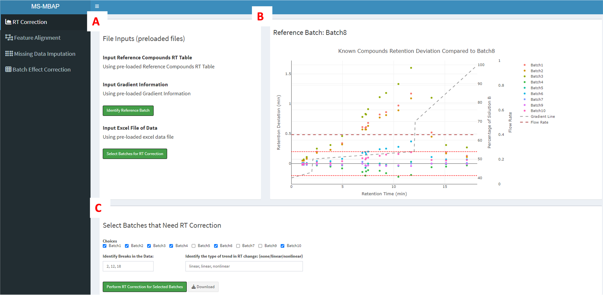
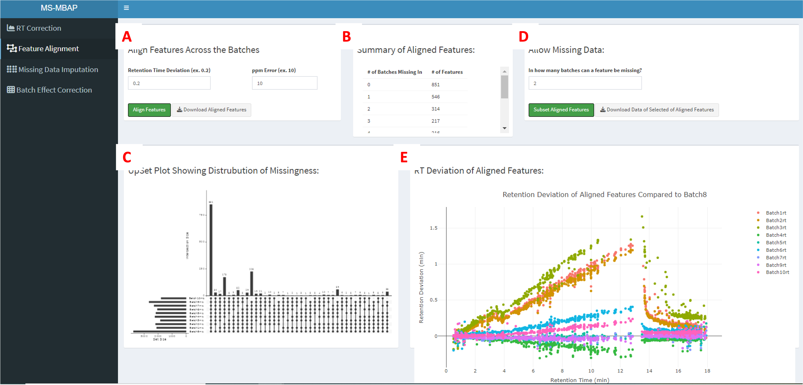
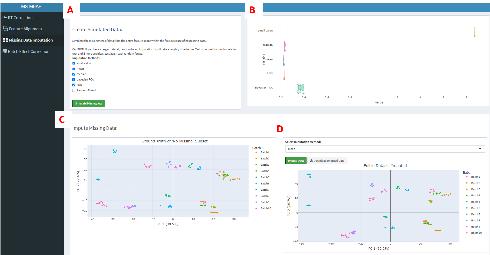
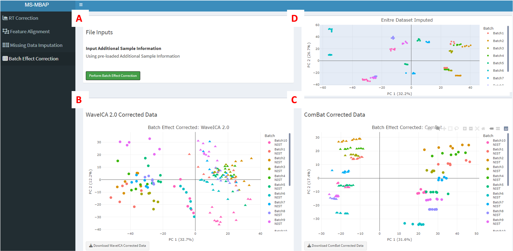

# MS-MBAP
#### Mass Spectrometry Multi-Batch Analysis Pipeline

The primary objective of MS-MBAP was to develop an integrated computational pipeline that included modules addressing individual challenges of processing multi-batched data through an automatic, cohesive workflow. 

### MS-MBAP has 4 modules
 

#### 1. Data Upload and RT Correction of Batches (if needed)

##### MS-MBAP RShiny interface – RT Correction. 
 -  &emsp;   **(A)** File upload area for information on internal standards, gradient, and study data. 
 - &emsp;   **(B)** Retention deviation plot generated from internal standard and gradient information uploaded in **(A)**. 
 - &emsp;   **(C)** Section in which selection of batches which need RT correction and input of data to create the piece-wise model is completed.
 
  

#### 2. Feature Alignment Across Batches

##### MS-MBAP RShiny interface – Feature Alignment. 
-  &emsp;   **(A)** Identify RT deviation and ppm error thresholds. 
-  &emsp;   **(B)** Total number of aligned features summarized by the number of batch(es) they are missing in. 
-  &emsp;   **(C)** Upset plot summarizing the intersection of features. 
-  &emsp;   **(D)** Identify the number of batches a feature can be missing in. 
-  &emsp;   **(E)** Retention deviation plot of aligned features compared to the reference batch. 

  

#### 3. Missing Data Imputation

##### MS-MBAP RShiny interface – Missing Data Imputation. 
-  &emsp;   **(A)** Select imputation method to test on simulated missing data 
-  &emsp;   **(B)** Notched box and whisker plots of 5-fold normalized root mean square error (NRMSE) values visually showing how each imputation method affects dataset. 
-  &emsp;   **(C)** PCA plot of the dataset visually showing ‘ground truth’ for features found across all batches. 
-  &emsp;   **(D)** Selection of imputation method and corresponding PCA plot of the dataset after imputation.

  

#### 4. Batch Effect Correction

##### MS-MBAP RShiny interface – Batch Effect Correction. 
-  &emsp;   **(A)** Upload additional sample meta-data (batch, sample type, and injection order).
-  &emsp;   **(B)** PCA plot of the WaveICA 2.0 corrected data 
-  &emsp;   **(C)** PCA plot of ComBat corrected data. 
-  &emsp;   **(D)** PCA plot of imputed dataset from previous tab.

The information in this repository is for research and educational purposes and not meant to be used in production environments and/or as part of commercial products.

Users should not use, share, or store sensitive data using the software.